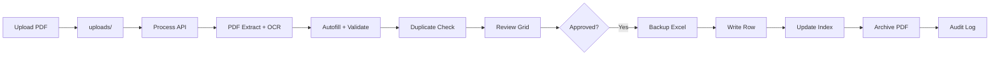

# RMA Masterfile Automation System — System Guide

Complete documentation for what the project is, how it was built, and how it works step by step.

---

## Table of Contents

1. [Overview](#1-overview)
2. [Architecture](#2-architecture)
3. [Project Structure](#3-project-structure)
4. [How It Was Built](#4-how-it-was-built)
5. [User Workflow](#5-user-workflow-step-by-step)
6. [Backend Services](#6-backend-services)
7. [PDF Extraction](#7-pdf-extraction)
8. [Duplicate Detection](#8-duplicate-detection)
9. [Authentication & Permissions](#9-authentication--permissions)
10. [Configuration](#10-configuration)
11. [API Reference](#11-api-reference)
12. [Frontend Architecture](#12-frontend-architecture)
13. [Running Locally](#13-running-locally)
14. [Deployment](#14-deployment)
15. [Troubleshooting](#15-troubleshooting)
16. [Extending the System](#16-extending-the-system)

---

## 1. Overview

The **RMA Masterfile Automation System** is a web application that:

1. Accepts **Delivery Note (DN) PDFs**
2. **Extracts** fields (DN number, device, quantity, date codes, etc.)
3. Lets engineers **review and edit** extracted data
4. **Detects duplicates** against an existing Excel masterfile
5. **Appends approved rows** to a single Excel workbook (`RMA_MASTER.xlsx`)
6. Tracks everything in an **audit log** with **role-based access control**

The Excel file is the **single source of truth**. A SQLite index speeds up search and duplicate checks.

---

## 2. Architecture

```
┌─────────────────────────────────────────────────────────────────┐
│  Browser (React + TypeScript + Tailwind)                        │
│  localhost:5173  │  Vercel (frontend only)                      │
└────────────────────────────┬────────────────────────────────────┘
                             │ HTTP /api/*
                             ▼
┌─────────────────────────────────────────────────────────────────┐
│  FastAPI Backend (Python) — localhost:8000                      │
│  ┌─────────────┐ ┌──────────────┐ ┌──────────────────────────┐  │
│  │ Auth (RBAC) │ │ PDF Extract  │ │ Excel + Index + Backup   │  │
│  └─────────────┘ └──────────────┘ └──────────────────────────┘  │
└────────────────────────────┬────────────────────────────────────┘
                             │
         ┌───────────────────┼───────────────────┐
         ▼                   ▼                   ▼
  uploads/*.pdf      storage/masterfile/    storage/index/
                     RMA_MASTER.xlsx        rma_index.db, auth.db
         processed/  storage/backup/
         logs/
```

### Tech Stack

| Layer | Technology |
|-------|------------|
| Frontend | React 19, TypeScript, Vite, Tailwind CSS, React Router |
| UI | Radix UI, Lucide icons |
| Backend | FastAPI, Uvicorn |
| PDF parsing | pdfplumber, PyMuPDF |
| OCR (scanned PDFs) | RapidOCR |
| Excel | openpyxl |
| Databases | SQLite (`auth.db`, `rma_index.db`) |
| Auth | bcrypt password hashing, session tokens |

---

## 3. Project Structure

```
PROJECTMD/
├── frontend/                 React dashboard
│   ├── src/
│   │   ├── pages/            One page per route (Upload, Preview, etc.)
│   │   ├── components/       UI (UploadZone, SpreadsheetReview, etc.)
│   │   ├── context/          AuthContext, AppContext (global state)
│   │   ├── api.ts            All backend API calls
│   │   └── lib/              reviewFields, validation helpers
│   └── vercel.json           SPA routing for Vercel deploy
│
├── backend/
│   ├── app/
│   │   ├── main.py           FastAPI entry point
│   │   ├── api/
│   │   │   ├── routes.py     Main API routes
│   │   │   ├── auth_routes.py Login, users, sessions
│   │   │   └── deps.py       Auth middleware
│   │   ├── models/           Pydantic schemas
│   │   └── services/         Business logic
│   └── config/
│       ├── settings.py       Paths, workers, env vars
│       ├── worksheet_config.json
│       ├── field_mapping.json
│       └── business_rules.json
│
├── storage/
│   ├── masterfile/           RMA_MASTER.xlsx (not in git)
│   ├── index/                auth.db, rma_index.db (not in git)
│   └── backup/               Excel backups before saves
├── uploads/                  Incoming PDFs
├── processed/                PDFs archived after save
└── logs/                     audit.log, duplicate_history.json
```

---

## 4. How It Was Built

The system was developed in layers:

### Phase 1 — Core Pipeline
- FastAPI server + React dashboard
- PDF upload → extract → preview → save to Excel
- Column mapping via JSON config (no code changes for column moves)

### Phase 2 — Excel Intelligence
- SQLite index mirrors active masterfile rows for fast search/duplicates
- Backup service before each save
- Excel lock detection if file is open in Microsoft Excel
- Case ID assignment and reuse of soft-deleted rows

### Phase 3 — PDF Quality
- OCR fallback when PDF text layer is empty
- Multi-page OCR until quantity and date codes are found
- European quantity formats (`10.000.00 PCE`, `15,000.00|PCE`)
- Parallel PDF processing (`PDF_PROCESS_WORKERS`)

### Phase 4 — Review Workflow
- Spreadsheet-style review grid with field source colors
- Required field validation before save
- Duplicate actions: skip, replace, revision, force insert

### Phase 5 — Auth & RBAC
- Login page, bcrypt passwords, session tokens (30 min or remember me)
- Roles: admin, engineer, viewer
- Protected routes on frontend + permission checks on backend

### Phase 6 — UX & Operations
- Live processing progress bar
- Upload file chips (size, DN, qty, status)
- Remove uploaded PDFs
- Engineer auto-fill on Rework Flow
- Admin: user management, masterfile reset, backup restore

---

## 5. User Workflow (Step by Step)

### Step 0 — Start the App

See [Running Locally](#13-running-locally).

### Step 1 — Login

1. User enters credentials on `/login`
2. Frontend calls `POST /api/auth/login`
3. Backend verifies password (bcrypt), creates session token in `auth.db`
4. Token stored in browser `localStorage`; sent on every API request
5. `ProtectedLayout` blocks routes if not logged in

### Step 2 — Dashboard (`/`)

- Shows stats: active records, processing counts, analytics
- Header shows **Active Records** and **Last Case ID**

### Step 3 — Upload DN PDFs (`/upload`)

1. User drags PDFs into **UploadZone** or clicks **Choose Files**
2. Frontend uploads via `POST /api/upload`
3. Backend saves files to `uploads/`
4. Chips show filename, size, and after processing: DN, qty, status badge

### Step 4 — Process PDFs

1. User triggers process (or upload auto-processes)
2. Frontend calls `POST /api/process`
3. Backend runs per PDF (can run in parallel):

```
PDF file
  → extract_dn_data()     [pdfplumber → PyMuPDF → OCR if needed]
  → autofill.enrich()     [business rules + historical DN matching]
  → validate_record()     [required fields, formats]
  → duplicate_service     [compare vs masterfile index]
  → ExtractedRecord       [status: New | Invalid | Duplicate]
```

4. Frontend polls `GET /api/process/status` for live progress
5. Results stored in `AppContext` as `records[]`

### Step 5 — Review (`/preview`)

Engineer reviews the spreadsheet grid:

| Color | Meaning |
|-------|---------|
| Green | Extracted from PDF |
| Blue | Auto-filled (rules/history) |
| Amber | Manually edited |
| Red | Missing required value |

Key fields: DN, Device, Package, Qty, Owner, GF, Type, DC, Date Code, Rework Flow, Engineer, RMA.

- **Rework Flow** entered → **Engineer** auto-fills with logged-in user name
- Duplicates show match info; user picks action (skip / replace / revision / force insert)
- Draft can persist in `localStorage`

### Step 6 — Save to Masterfile

1. User approves records and clicks **Save**
2. Frontend sends `POST /api/save`
3. Backend:
   - Checks Excel is not locked
   - Creates backup in `storage/backup/`
   - Assigns next **Case ID**
   - Writes row to active worksheet (e.g. `FY2526`)
   - Updates SQLite index
   - Moves PDF to `processed/`
   - Writes audit log entry

> **Important:** Close Excel before saving. An open workbook causes a lock error.

### Step 7 — Other Pages

| Page | Path | Purpose |
|------|------|---------|
| Masterfile | `/masterfile` | Browse active rows |
| Search | `/search` | Fast search via index |
| Download | `/download` | Download `RMA_MASTER.xlsx` |
| History | `/history` | Audit log |
| Recycle Bin | `/recycle-bin` | Soft-deleted records (admin) |
| Settings | `/settings` | Backups, reset, config (admin) |
| Users | `/users` | User management (admin) |

### End-to-End Data Flow



---

## 6. Backend Services

| Service | File | Responsibility |
|---------|------|----------------|
| PDF extraction | `pdf_extractor.py` | Read PDF text, parse DN layout, OCR fallback |
| OCR | `ocr_service.py` | Render pages to images, run RapidOCR |
| Autofill | `autofill_service.py` | Business rules; historical DN matching |
| Validation | `validation.py` | Mark records Invalid if required fields missing |
| Duplicates | `duplicate_service.py` | Score match vs existing rows |
| Processing | `processing_service.py` | Upload → process → save pipeline |
| Excel | `excel_service.py` | Read/write workbook preserving formatting |
| Layout | `excel_layout.py` | Row insertion, Case ID, column mapping |
| Index | `index_db.py` | SQLite mirror of active Excel rows |
| Records | `record_service.py` | CRUD, soft delete, index rebuild |
| Backup | `backup_service.py` | Timestamped Excel backups |
| Lock | `lock_service.py` | In-memory edit lock |
| Audit | `audit_logger.py` | Append-only audit + duplicate history |
| Auth | `auth_service.py` | Login, sessions, user CRUD |
| Permissions | `permissions.py` | Role → permission matrix |

---

## 7. PDF Extraction

**Order of attempts:**

1. **pdfplumber** — extract text from PDF text layer
2. **PyMuPDF** — fallback text extraction
3. **OCR** — if text is insufficient; scans pages until DN, device, **qty**, and **date codes** are found

**Parsed fields include:** `dn_number`, `device`, `package`, `quantity`, `date_code`, `rma_number`, `customer_name`, `plant_code`, `lot_number`, and more.

**Quantity parsing** handles European formats like `10.000.00TPCE` and sums line items.

Failed extraction → record status **Invalid** with error message in the review grid.

---

## 8. Duplicate Detection

Compares new records against all **active** masterfile rows using weighted fields:

- DN number, RMA, device (identity)
- quantity, date code, owner, package, store received, case title

**Results:**

| Status | Meaning |
|--------|---------|
| New | No strong match |
| Possible Duplicate | Partial match |
| Exact Duplicate | High confidence match |

User must choose an action before save for duplicates.

---

## 9. Authentication & Permissions

### Default Users

| Username | Password | Role |
|----------|----------|------|
| admin | admin123 | Administrator |
| engineer1 | engineer123 | Engineer |
| viewer1 | viewer123 | Viewer |

### Role Permissions

| Permission | Admin | Engineer | Viewer |
|------------|:-----:|:--------:|:------:|
| view, search, download | ✓ | ✓ | ✓ |
| upload, process, edit | ✓ | ✓ | — |
| delete, configure, manage users | ✓ | — | — |

### Session Behavior

- Default timeout: **30 minutes**
- **Remember me**: longer session (days)
- Token sent as `Authorization: Bearer <token>` on API calls

### Storage

- `storage/index/auth.db` — users, password hashes, sessions
- **Never commit this file to GitHub**

---

## 10. Configuration

| File | Purpose |
|------|---------|
| `backend/config/worksheet_config.json` | Active sheet (`FY2526`), header/data rows |
| `backend/config/field_mapping.json` | Excel column → field name |
| `backend/config/business_rules.json` | Autofill logic |
| `backend/config/reference_lookups.json` | Dropdown/reference data |

### Environment Variables (optional)

| Variable | Description |
|----------|-------------|
| `PDF_PROCESS_WORKERS` | Parallel PDF processing threads |
| `OCR_RENDER_SCALE` | OCR image quality vs speed |
| `VITE_API_BASE` | Frontend API URL for production (Vercel) |

---

## 11. API Reference

| Method | Endpoint | Description |
|--------|----------|-------------|
| GET | `/api/health` | Health check |
| POST | `/api/auth/login` | Login |
| POST | `/api/auth/logout` | Logout |
| GET | `/api/auth/me` | Current user |
| POST | `/api/upload` | Upload PDFs |
| DELETE | `/api/uploads/{filename}` | Remove uploaded PDF |
| POST | `/api/process` | Extract and validate |
| GET | `/api/process/status` | Processing progress |
| POST | `/api/save` | Save to Excel |
| GET | `/api/download` | Download masterfile |
| GET | `/api/stats` | Dashboard stats |
| GET | `/api/logs` | Audit log |
| GET | `/api/masterfile/rows` | List records |
| POST | `/api/masterfile/reset` | Reset masterfile (admin) |

Most routes require authentication. Many require specific permissions.

---

## 12. Frontend Architecture

```
App.tsx
 ├── ThemeProvider        (dark/light mode)
 ├── AuthProvider         (login, session, user role)
 └── AppProvider          (records, uploads, save, progress)
      └── BrowserRouter
           ├── /login
           └── ProtectedLayout (sidebar + header)
                ├── Dashboard, Upload, Preview, ...
                └── RequirePermission (per route)
```

**Key files:**

| File | Purpose |
|------|---------|
| `src/api.ts` | All `fetch()` calls; uses `/api` locally or `VITE_API_BASE` in production |
| `src/context/AppContext.tsx` | Central state: uploads, records, edits, save flow |
| `src/context/AuthContext.tsx` | Login, session, role |
| `src/lib/reviewFields.ts` | Review grid columns and validation rules |

Locally, Vite proxies `/api` → `http://localhost:8000` (see `vite.config.ts`).

---

## 13. Running Locally

You need **two terminals** running at the same time.

### Terminal 1 — Backend

```powershell
cd backend
python -m venv venv          # first time only
.\venv\Scripts\pip install -r requirements.txt   # first time only
.\venv\Scripts\uvicorn app.main:app --reload --port 8000
```

Verify: http://localhost:8000/api/health

### Terminal 2 — Frontend

```powershell
cd frontend
npm install                  # first time only
npm run dev
```

Open: **http://localhost:5173**

### Prerequisites

- Python 3.10+
- Node.js 18+
- Place `RMA_MASTER.xlsx` in `storage/masterfile/` before first use
- Close Excel before saving records

---

## 14. Deployment

### One deploy (recommended)

Build the React app into the FastAPI image and serve UI + API from **one** URL:

| Host | How |
|------|-----|
| **Render** | Blueprint from `render.yaml` (Docker + disk at `/var/data`) |
| **Railway** | Deploy repo; uses `Dockerfile` / `railway.json`; mount volume at `/data` |
| **Docker** | `docker compose up --build` → http://localhost:8000 |

No `VITE_API_BASE` is required in production (`VITE_API_BASE=/api`, same origin).

### Local development

Run backend (`uvicorn` on :8000) and frontend (`npm run dev` on :5173). Vite proxies `/api` to the backend.

### Vercel (frontend-only, not recommended alone)

`vercel.json` can host the static UI, but you still need a separate API host and `VITE_API_BASE`. Prefer the single Docker deploy above.

---

## 15. Troubleshooting

| Problem | Cause | Fix |
|---------|-------|-----|
| Request failed on Vercel | No backend / wrong API URL | Deploy API separately + set `VITE_API_BASE` |
| Bundle size > 500 MB on Vercel | Python backend + OCR deps | Deploy frontend only; host API on Render/Railway |
| Scanned PDF extract fails | OCR not installed | `pip install -r requirements.txt` (full, not lite) |
| Excel locked | File open in Excel | Close the workbook |
| Missing qty / date codes | OCR stopped too early | Restart backend (fixed in `pdf_extractor.py`) |
| Case ID starts at 2 | Deleted row still counted | Fixed in `excel_layout.py` |
| 0 active records shown | Status enum mismatch | Fixed in `status_utils.py` |
| Login fails locally | Backend not running | Start uvicorn on port 8000 |
| Wrong credentials | Username typo | Use `admin`, not `admin1` |
| CRLF git warnings | Normal on Windows | Safe to ignore |

---

## 16. Extending the System

| Goal | Where to change |
|------|-----------------|
| Add fiscal year worksheet | `worksheet_config.json` + new Excel sheet |
| Tune PDF parsing | `pdf_extractor.py` with sample PDFs |
| Add review column | `reviewFields.ts` + `field_mapping.json` + schema |
| Add role or permission | `permissions.py` + frontend route guards |
| Change session timeout | `auth_db.py` (`SESSION_TIMEOUT_MINUTES`) |

---

## Related Files

- [README.md](../README.md) — Quick start
- [frontend/.env.example](../frontend/.env.example) — Production API URL
